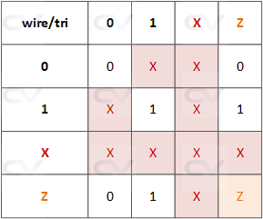

# Verilog Notes

- Specify the left hand value in the range as the most significant bit, while the right hand value as the least significant bit
- You cannot use variable for range declaration 
```
wire [most_significant_bit : least_significant_bitw] name

wire [15:0] priority
```

- Part-selects: constant part-select and indexed part-select
```
addr [23:16] = 8'h23;

[<start_bit> +: <width>]     // part-select increments from start-bit
[<start_bit> -: <width>]     // part-select decrements from start-bit
                             // width here is how many bit, the size
```

- Scalar is a net or reg declaration that is 1-bit wide
- Vector is a net or reg declaration that is multibit wide 

- Array in Verilog can be scalar or vector, and can be multi-dimensional as well
```
reg        y1 [11:0];      // scalar reg array of depth 12
wire [7:0] y2 [3:0];       // an 8-bit vector net with a depth of 4
reg  [7:0] y3 [0:1][0:3];  // an 2D 8-bit vector net with 2 rows and 4 columns

```

- Storage elements in Verilog can be modeled using one-dimensional arrays of type `reg` and is called memory

### Register Vector
```
module des (    input           clk,
                input           rstn,
                input           wr,
                input           sel,
                input [15:0]    wdata,
                output [15:0]   rdata);

	reg [15:0] register;

	always @ (posedge clk) begin
    if (!rstn)
    	register <= 0;
    else begin
    	if (sel & wr)
      	register <= wdata;
    	else
      	register <= register;
    end
	end

	assign rdata = (sel & ~wr) ? register : 0;
endmodule
```

### Memory Example
```
module des (    input           clk,
                input           rstn,
                input  [1:0]    addr,
                input           wr,
                input           sel,
                input [15:0]    wdata,
                output [15:0]   rdata);

reg [15:0] register [0:3];
integer i;

always @ (posedge clk) begin
    if (!rstn) begin
        for (i = 0; i < 4; i = i+1) begin
            register[i] <= 0;
        end
    end else begin
        if (sel & wr)
            register[addr] <= wdata;
        else
            register[addr] <= register[addr];
    end
end

assign rdata = (sel & ~wr) ? register[addr] : 0;
endmodule
```

### Net Types
| **Month**    | **Savings** |
| -------- | ------- |
| wire     | Connects elements with continuous assignment                    |
| tri      | Connects elements with multiple drivers                         |
| wor      | Creates wired OR configurations                                 |
| wand     | Creates wired AND configurations                                |
| trior    | Creates wired OR configurations with multiple drivers           |
| triand   | Creates wired AND configurations with multiple drivers          |
| tri0     | Models nets with resistive pulldown devices                     |
| tri1     | Models nets with resistive pullup devices                       |
| uwire    | Models nets that can should be driven only by a single driver   |signifies that the driver will actively drive the net to a logic high (1) with strong strength, pulling the net up to 1 and overpowering weaker driverssignifies that the driver will actively drive the net to a logic high (1) with strong strength, pulling the net up to 1 and overpowering weaker driversk
| supply0  | Models power supply with a low level of strength                |
| supply1  | Models power supply with a high level of strength               |
<br />

Wire Nets

- Used for connections driven by a single source
- Ideal for nets controlled by one gate or one continuous assignment
- Simple, unidirectional connection

Tri Nets

- Used for nets that may have multiple drivers
- Suitable for modeling buses or other shared connections where different components might drive the net at different times
- `tri` implies the possibility of multiple drivers and the potential use of high-impedance states

<div style="text-align: center;">
    
</div>

### Strength

- Strength of driving a net refers to the relative power or capability of a driver to influence the value of a net
- Two types of strengths can be specified in net declaration: charge strength and drive strength

Charge Strength
- Used with `trireg`
- Can have three different levels of strength: `small`, `medium`, `large`
- This strength determines how quickly a charge decay on the net when it is not actively driven
- This provides more accurate real-world behavior when simulating
```
trireg                          a_net;    // strength medium by default
trireg   (medium) #(0, 0, 100)  cap1;     // strength medium, charge decay time of 100 time units
trireg   (large)  [3:0]         cap2;     // strength large, no decay time
```

Drive Strength
- This strength is the capability of a driver to influence the value of a net
- It indicates how strongly a signal is driven on the output terminals of a gate or net
- This is especially crucial when multiple drivers are driving the same net and controlling the same net, since the net will take whatever is the strongest driver, and if there are conflicting values from the drivers of the same length, the result will be unknown
```
assign  (strength1, strength0) net = expression;
// strength1: The strength when the net is driven to logic 1.
// strength0: The strength when the net is driven to logic 0.

wire out;

assign (strong1, weak0) out = a & b; // Drives 'out' with strong1 when true
```
***Keywords for strength***
<ul>
    <li>supply0
        <ul>
        <li>Always driven to a logic low (0) value, used to represent ground or negative power, remains 0 if no other drive is present</li>
        </ul>
    </li>
    <li>supply1
        <ul>
        <li>Always driven to a logic low (0) value, used to represent ground or negative power, remains 0 if no other drive is present</li>
        </ul>
    </li>
    <li>strong0
        <ul>
        <li>Indicates that the driver will actively drive the net to a logic low (0) with strong strength, capable of pulling the net down to 0 and overriding weaker drivers</li>
        </ul>
    </li>
    <li>strong1
        <ul>
        <li>Signifies that the driver will actively drive the net to a logic high (1) with strong strength, pulling the net up to 1 and overpowering weaker drivers
        </li>
        </ul>
    </li>
    <li>pull0
        <ul>
        <li>Similar to apull-down resistor, the net has a resistive pull-down device connected to it</li>
        </ul>
    </li>
    <li>pull1
        <ul>
        <li>Signifies that a net has a resistive pull-up device connected to it, similar to a pull-up resistor</li>
        </ul>
    </li>
    <li>weak0
        <ul>
        <li>Indicates that a net will be driven to a logic low (0) with a weak driving capability</li>
        </ul>
    </li>
    <li>weak1
        <ul>
        <li>Indicates that a net will be driven to a logic high (1) with a weak driving capability</li>
        </ul>
    </li>
    <li>highz0
        <ul>
        <li>Indicates that a net is in a high-impedance state while being driven to a logic low (0), typically used for modeling nets that can be disconnected or tri-stated, allowing the net to effectively "float" at 0</li>
        </ul>
    </li>
    <li>highz1
        <ul>
        <li>Signifies that a net is in a high-impedance state while being driven to a logic high (1), this strength is used in scenarios where the net can be tri-stated and should float at 1 when not actively driven</li>
        </ul>
    </li>
</ul>


